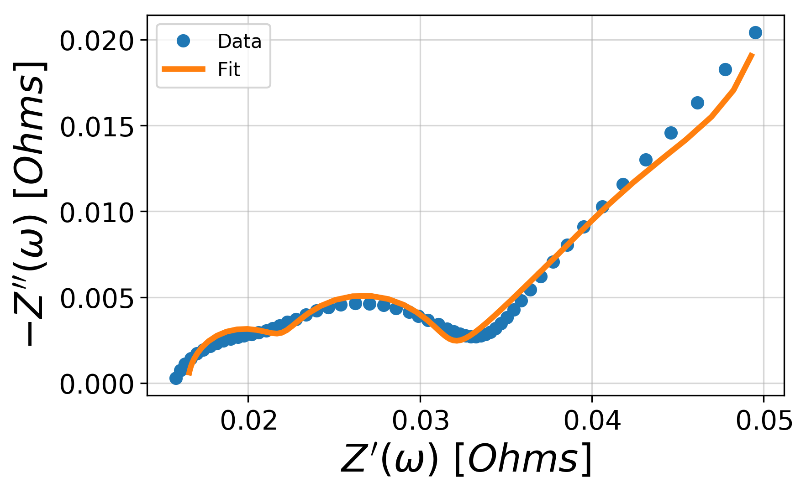

=========================================
Getting started with :code:`impedance.py`
=========================================

:code:`impedance.py` is a Python package for analyzing electrochemical impedance
spectroscopy (EIS) data. The following steps will show you how to get started
analyzing your own data using :code:`impedance.py` in a Jupyter notebook.

.. hint::
  If you get stuck or believe you have found a bug, please feel free to open an
  `issue on GitHub <https://github.com/ECSHackWeek/impedance.py/issues>`_.

Step 1: Installation
====================

If you already are familiar with managing Python packages, feel free to skip
straight to `Installing packages`_.
Otherwise, what follows is a quick introduction to the Python package ecosystem:

Installing Miniconda
--------------------
One of the easiest ways to get started with Python is using Miniconda.
Installation instructions for your OS can be found at
https://conda.io/miniconda.html.

After you have installed conda, you can run the following commands in your
Terminal/command prompt/Git BASH to update and test your installation:

1. Update conda’s listing of packages for your system: :code:`conda update conda`

2. Test your installation: :code:`conda list`

  For a successful installation, a list of installed packages appears.

3. Test that Python 3 is your default Python: :code:`python -V`

  You should see something like Python 3.x.x :: Anaconda, Inc.

You can interact with Python at this point, by simply typing :code:`python`.

Setting up a conda environment
------------------------------
*(Optional)* It is recommended that you use virtual environments to keep track
of the packages you've installed for a particular project. Much more info on
how conda makes this straightforward is given `here <https://conda.io/projects/conda/en/latest/user-guide/tasks/manage-environments.html#viewing-a-list-of-your-environments>`_.

We will start by creating an environment called :code:`impedance-analysis`
which contains all the Python base distribution:

.. code-block:: bash

   conda create -n impedance-analysis python=3

After conda creates this environment, we need to activate it before we can
install anything into it by using:

.. code-block:: bash

   conda activate impedance-analysis

We've now activated our conda environment and are ready to install
:code:`impedance.py`!

Installing packages
-------------------

The easiest way to install :code:`impedance.py` and it's dependencies
(:code:`scipy`, :code:`numpy`, and :code:`matplotlib`) is from
`PyPI <https://pypi.org/project/impedance/>`_ using pip:

.. code-block:: bash

   pip install impedance

For this example we will also need Jupyter Lab which we can install with:

.. code-block:: bash

   conda install jupyter jupyterlab

We've now got everything in place to start analyzing our EIS data!

.. note::
  The next time you want to use this same environment, all you have to do is
  open your terminal and type :code:`conda activate impedance-analysis`.

Open Jupyter Lab
----------------

*(Optional)* Create a directory in your documents folder for this example:

.. code-block:: bash

   mkdir ~/Documents/impedance-example

   cd ~/Documents/impedance-example

Next, we will launch an instance of Jupyter Lab:

.. code-block:: bash

  jupyter lab

which should open a new tab in your browser. A tutorial on Jupyter Lab from the
Electrochemical Society HackWeek can be found `here <https://ecshackweek.github.io/tutorial/getting-started-with-jupyter/>`_.

.. tip::
  The code below can be found in the `getting-started.ipynb <_static/getting-started.ipynb>`_ notebook

Step 2: Import your data
========================

This example will assume the following dataset is located in your current working directory (feel free to replace it with your data): :download:`exampleData.csv <_static/exampleData.csv>`

For this dataset, importing the data looks something like:

.. code-block:: python

  from impedance import preprocessing

  # Load data from the example EIS result
  frequencies, Z = preprocessing.readCSV('./exampleData.csv')

  # keep only the impedance data in the first quandrant
  frequencies, Z = preprocessing.ignoreBelowX(frequencies, Z)

.. tip::
  Functions for reading in files from a variety of vendors (ZPlot, Gamry, Parstat, Autolab, ...) can be found in the `preprocessing module <preprocessing.html>`_!

Step 3: Define your impedance model
===================================

Next we want to define our impedance model. In order to enable a wide variety
of researchers to use the tool, :code:`impedance.py` allows you to define a
custom circuit with any combination of `circuit elements <circuit-elements.html>`_.

The circuit is defined as a string (i.e. using :code:`''` in Python), where elements in
series are separated by a dash (:code:`-`), and elements in parallel are wrapped in
a :code:`p( , )`. Each element is defined by the function (in `circuit-elements.py <circuit-elements.html>`_) followed by a single digit identifier.

For example, the circuit below:

would be defined as :code:`R0-p(R1,C1)-p(R2-Wo1,C2)`.

Each circuit, we want to fit also needs to have an initial guess for each
of the parameters. These inital guesses are passed in as a list in order the
parameters are defined in the circuit string. For example, a good guess for this
battery data is :code:`initial_guess = [.01, .01, 100, .01, .05, 100, 1]`.

We create the circuit by importing the CustomCircuit object and passing it our
circuit string and initial guesses.

.. code-block:: python

  from impedance.models.circuits import CustomCircuit

  circuit = 'R0-p(R1,C1)-p(R2-Wo1,C2)'
  initial_guess = [.01, .01, 100, .01, .05, 100, 1]

  circuit = CustomCircuit(circuit, initial_guess=initial_guess)

Step 4: Fit the impedance model to data
=======================================

Once we've defined our circuit, fitting it to impedance data is as easy as
calling the `.fit()` method and passing it our experimental data!

.. code-block:: python

  circuit.fit(frequencies, Z)

We can access the fit parameters with :code:`circuit.parameters_` or by
printing the circuit object itself, :code:`print(circuit)`.

Step 5: Analyze/Visualize the results
=====================================

For this dataset, the resulting fit parameters are

================ ========
   Parameter      Value
---------------- --------
:math:`R_0`      1.65e-02
:math:`R_1`      8.68e-03
:math:`C_1`      3.32e+00
:math:`R_2`      5.39e-03
:math:`Wo_{1,0}` 6.31e-02
:math:`Wo_{1,1}` 2.33e+02
:math:`C_2`      2.20e-01
================ ========

We can get the resulting fit impedance by passing a list of frequencies to the :code:`.predict()` method.

.. code-block:: python

  Z_fit = circuit.predict(frequencies)

To easily visualize the fit, the :code:`plot_nyquist()` function can be handy.

.. code-block:: python

  import matplotlib.pyplot as plt
  from impedance.visualization import plot_nyquist

  fig, ax = plt.subplots()
  plot_nyquist(ax, Z, fmt='o')
  plot_nyquist(ax, Z_fit, fmt='-')

  plt.legend(['Data', 'Fit'])
  plt.show()

.. important::
  🎉 Congratulations! You're now up and running with impedance.py 🎉
